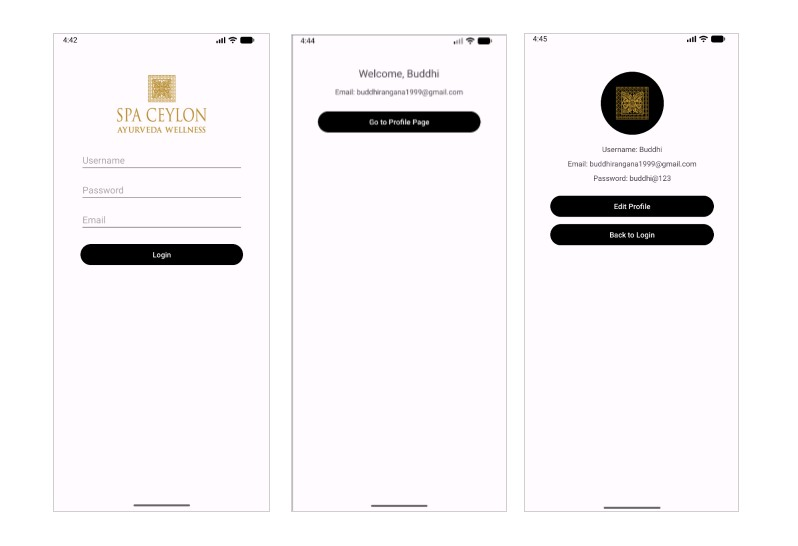

# Spa Ceylon App

A simple **Android application** built using **Kotlin**, inspired by the *Spa Ceylon – Ayurveda Wellness* brand.  
This mini project demonstrates basic Android UI design and user navigation between multiple screens.

## App Overview

The app includes **three main screens**:

1. **Login Screen** – Users can enter their username, password, and email to log in.  
2. **Welcome Screen** – Displays a welcome message with the user’s details after login.  
3. **Profile Screen** – Shows user information (username, email, password) with options to edit the profile or return to login.

## App Preview



## Tech Stack

- **Language:** Kotlin  
- **IDE:** Android Studio  
- **Framework:** Android SDK  
- **UI Components:** ConstraintLayout, EditText, Button, TextView, ImageView  
- **Navigation:** Intents for screen transitions

## How It Works

1. The user enters credentials on the **Login Screen**.  
2. After submitting, the app navigates to the **Welcome Screen**, showing a personalized message.  
3. The user can view or edit their information on the **Profile Screen** and navigate back to login if needed.

## Getting Started

### Prerequisites

- Android Studio (Arctic Fox or newer)  
- Android SDK 30+  
- Basic knowledge of Kotlin and Android development

### Installation

```bash
git clone https://github.com/buddhirangana/spa-ceylon-app.git
cd spa-ceylon-app
```

Then open the project in Android Studio and click Run ▶️.

## Project Structure

```
spa-ceylon-app/
├── app/
│   ├── src/
│   │   ├── main/
│   │   │   ├── java/com/example/spaceylonapp/
│   │   │   │   ├── LoginActivity.kt
│   │   │   │   ├── WelcomeActivity.kt
│   │   │   │   └── ProfileActivity.kt
│   │   │   └── res/
│   │   │       ├── layout/
│   │   │       ├── drawable/
│   │   │       └── values/
│   │   └── AndroidManifest.xml
└── build.gradle
```

## Purpose
This mini project was created as a sample Kotlin Android app to practice UI design, screen navigation, and data passing between activities.

## Contact
For queries or feedback, please contact:
- **Link in Bio:** https://bento.me/buddhirangana
- **GitHub:** [Buddhi Rangana](https://github.com/buddhirangana)

## License
This project is created for educational purposes only and is not affiliated with Spa Ceylon. You are free to use, modify, and learn from this code.
